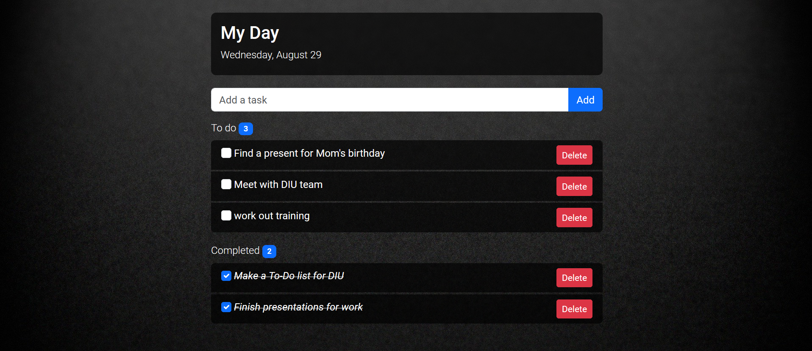

# Práctica 2

**Nombre:** Irving Miguel Abundes Gutiérrez

**Número de cuenta:** 319236170
***

## Ver la página
Basta con ver el archivo _ToDo.html_ en cualquier navegador. Yo estuve trabajando en Brave.
***
## Descripción

La lista de tareas hace una división entre tareas que han sido completadas en  **_Completed_** y las tareas que falta por hacer en  **_To do_**. Cada una de estas divisiones tiene un contador.

Para marcar o desmarcar una tarea como completada basta con hacer click sobre la _checkbox_ o sobre el texto de la tarea.

Una vez que la tarea se marque como completada el texto tendrá una decoración _line-through_ y tambien un estilo _italic_ .

***
## Visualización

